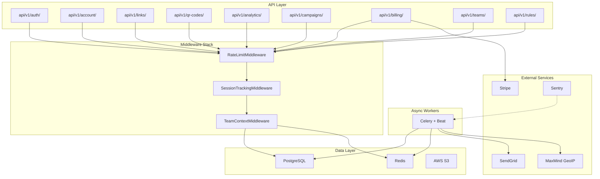

# TinlyLink Backend Analysis

## Overview

**TinlyLink** is a production-grade URL shortener & QR code platform built with **Django 5.2** + **DRF**. It's organized into **9 app modules** with a clean separation of concerns, backed by PostgreSQL, Redis, and Celery.

---

## Architecture Diagram



---

## App Modules

### 1. `apps.users` — Authentication & Account Management
| Component | Key Files |
|-----------|-----------|
| Models | [models.py](file:///d:/fly_me/update-me/me/backend/apps/users/models.py) — `User` (UUID PK, Argon2 hashing), `Subscription`, `APIKey`, `UsageTracking` |
| Auth | [authentication.py](file:///d:/fly_me/update-me/me/backend/apps/users/authentication.py) — Custom JWT + API Key auth backends |
| Middleware | [middleware.py](file:///d:/fly_me/update-me/me/backend/apps/users/middleware.py) — `RateLimitMiddleware` (token bucket via Redis), `SessionTrackingMiddleware`, `SecurityHeadersMiddleware` |
| Permissions | [permissions.py](file:///d:/fly_me/update-me/me/backend/apps/users/permissions.py) — `HasPaidPlan`, `HasBusinessPlan`, `CanCreateLinks`, `CanCreateQRCodes`, `CanUseCustomSlug`, `IsOwner` |
| Tasks | [tasks.py](file:///d:/fly_me/update-me/me/backend/apps/users/tasks.py) — Email notifications, weekly reports, unverified user cleanup, Stripe sync, GDPR data export, session cleanup |

**Auth flow**: JWT with 15-min access + 7-day refresh tokens, automatic rotation + blacklisting. Google OAuth2 supported.

---

### 2. `apps.links` — Core URL Shortening
| Component | Key Files |
|-----------|-----------|
| Models | [models.py](file:///d:/fly_me/update-me/me/backend/apps/links/models.py) — `Link` (nanoid short codes, UTM params, password protection, expiry), `CustomDomain` (DNS verification) |
| Views | [views.py](file:///d:/fly_me/update-me/me/backend/apps/links/views.py) — CRUD, bulk create, duplicate, stats; [views_redirect.py](file:///d:/fly_me/update-me/me/backend/apps/links/views_redirect.py) — Redirect handler with caching + ads interstitial; [views_import_export.py](file:///d:/fly_me/update-me/me/backend/apps/links/views_import_export.py) — CSV/Excel import/export |
| Tasks | [tasks.py](file:///d:/fly_me/update-me/me/backend/apps/links/tasks.py) — Click tracking (async w/ GeoIP + UA parsing), expired link cleanup, domain verification, bulk creation, link export |

**Redirect path**: Redis-cached lookups → ads interstitial for free plan → rules evaluation → 302 redirect. Click tracked async via Celery.

---

### 3. `apps.qrcodes` — QR Code Generation & Serialization
| Component | Key Files |
|-----------|-----------|
| Models | [models.py](file:///d:/fly_me/update-me/me/backend/apps/qrcodes/models.py) — `QRCode` (15+ content types: URL, vCard, WiFi, payment, etc.; styles, logos, frames), `SerialBatch`, `SerialCode` (product authentication with suspicion scoring) |
| Views | [views.py](file:///d:/fly_me/update-me/me/backend/apps/qrcodes/views.py) — CRUD, download (PNG/SVG/PDF), preview, framed download, batch download as ZIP, serialization batch management, public verification page |

**QR Types**: URL, vCard, WiFi, Email, SMS, Phone, Location, Text, Payment (UPI/BTC/ETH), Product, Multi-destination, App Store  
**Output formats**: PNG, SVG, PDF with custom styling (colors, dots/rounded/square pattern, logos with SSRF protection)

---

### 4. `apps.analytics` — Click & Scan Analytics
| Component | Key Files |
|-----------|-----------|
| Models | [models.py](file:///d:/fly_me/update-me/me/backend/apps/analytics/models.py) — `ClickEvent` (unified link + QR tracking, 20+ fields), `DailyStats` (pre-aggregated), `CountryStats`, `ReferrerStats` |
| Views | [views.py](file:///d:/fly_me/update-me/me/backend/apps/analytics/views.py) — Overview, clicks chart, geography, devices, referrers, export (sync + async), real-time, period comparison, top links, unified analytics (per link/QR/campaign) |

**Analytics pipeline**: Click → Redis counter (5-min sync) → `ClickEvent` row → hourly/daily aggregation via Celery Beat → pre-computed `DailyStats` for fast dashboards.

---

### 5. `apps.billing` — Stripe Subscription Management
| Component | Key Files |
|-----------|-----------|
| Views | [views.py](file:///d:/fly_me/update-me/me/backend/apps/billing/views.py) — `BillingOverviewView`, `CreateCheckoutSessionView`, `CreatePortalSessionView`, `StripeWebhookView` |

**No separate models** — uses `Subscription` from `apps.users`. Handles 6 webhook events: `checkout.session.completed`, `customer.subscription.{created,updated,deleted}`, `invoice.payment_{succeeded,failed}`.

---

### 6. `apps.campaigns` — Marketing Campaign Management
| Component | Key Files |
|-----------|-----------|
| Models | [models.py](file:///d:/fly_me/update-me/me/backend/apps/campaigns/models.py) — `Campaign` (scheduling, click budget, fallback URL, UTM defaults, tags), `Variant` (A/B testing with weighted distribution), `VariantSelector` |

Supports campaign lifecycle: Draft → Scheduled → Active → Paused → Completed. Status updates run every minute via Celery Beat.

---

### 7. `apps.teams` — Multi-User Collaboration
| Component | Key Files |
|-----------|-----------|
| Models | [models.py](file:///d:/fly_me/update-me/me/backend/apps/teams/models.py) — `Team`, `TeamMember` (owner/admin/editor/viewer roles), `TeamInvite` (token-based, 7-day expiry) |

`TeamContextMiddleware` injects current team into requests. `IsOwner` permission checks both ownership and team membership.

---

### 8. `apps.rules` — Conditional Redirect Engine
| Component | Key Files |
|-----------|-----------|
| Models | [models.py](file:///d:/fly_me/update-me/me/backend/apps/rules/models.py) — `Rule` (condition types: geo, device, time, language, UTM, header, query param; actions: redirect, block, show message, A/B test), `RuleGroup` (AND/OR logic), `RuleCondition` |

Rules attach to links, QR codes, campaigns, or serial batches. Evaluated by priority during redirect.

---

### 9. `apps.public` — Landing Pages & SEO
Serves static marketing pages (landing, pricing, blog), sitemaps, robots.txt, and a public verification API.

---

## Plan System

| Feature | Free | Pro ($12) | Business ($49) | Enterprise ($99) |
|---------|------|-----------|-----------------|-------------------|
| Links/month | 50 | 500 | 5,000 | Unlimited |
| QR codes/month | 10 | 100 | 500 | Unlimited |
| Custom domains | 0 | 1 | 10 | 50 |
| Analytics retention | 30d | 1yr | 2yr | 10yr |
| Custom slugs | ❌ | ✅ | ✅ | ✅ |
| Password protection | ❌ | ✅ | ✅ | ✅ |
| Ads | ✅ | ❌ | ❌ | ❌ |
| Team members | 0 | 0 | 15 | 100 |
| Serial batch limit | — | — | 10,000 | 100,000 |

---

## Celery Beat Schedule (13 tasks)

| Task | Schedule | Queue |
|------|----------|-------|
| Aggregate hourly stats | Every hour at :05 | analytics |
| Aggregate daily stats | Daily 00:15 UTC | analytics |
| Sync click counters | Every 5 min | analytics |
| Sync QR scan counters | Every 5 min | analytics |
| Cleanup expired links | Every hour | default |
| Cleanup old analytics | Daily 2:00 UTC | analytics |
| Cleanup unverified users | Daily 3:00 UTC | priority |
| Cleanup scheduled deletions | Daily 3:30 UTC | default |
| Cleanup expired batch exports | Daily 4:30 UTC | default |
| Verify pending domains | Every 15 min | default |
| Partition maintenance | Monthly | analytics |
| Weekly reports | Monday 9am UTC | priority |
| Update campaign statuses | Every minute | default |
| Sync campaign stats | Every hour at :30 | default |
| Sync Stripe subscriptions | Daily 5:00 UTC | default |

---

## Infrastructure & Security

- **Auth**: JWT (HS256) + API Key with scoped permissions
- **Rate limiting**: Redis sliding window — plan-based (e.g., free: 10/hr shorten, enterprise: unlimited)
- **Password hashing**: Argon2 (primary) + PBKDF2 (fallback)
- **Production security**: HSTS, secure cookies, CSRF, X-Frame-Options DENY, SSL redirect, Sentry monitoring
- **URL safety**: Blocked patterns for localhost, private IPs, dangerous schemes, .onion
- **Health checks**: `/health/`, `/ready/` (DB + Redis + Celery), `/live/`, `/metrics/` (Prometheus)
- **Caching**: Redis with 50 max connections, 15s timeouts, `tinlylink` key prefix
- **Storage**: WhiteNoise for static files, S3 for media (signed URLs, 1hr expiry)
- **API docs**: drf-spectacular (Swagger + ReDoc) at `/api/docs` and `/api/`

---

## Test Structure

```
tests/
├── conftest.py          # Shared fixtures
├── factories.py         # factory-boy factories for all models
├── test_analytics/
├── test_billing/
├── test_campaigns/
├── test_links/
├── test_qrcodes/
├── test_teams.py
└── test_users/
```

Uses pytest + pytest-django with factory-boy, faker, responses (HTTP mocking), and freezegun (time mocking).

---

## Key Observations

> [!TIP]
> **Strengths**: Clean module separation, comprehensive plan-based permissions, Redis-backed analytics pipeline, unified ClickEvent model for links + QR codes + campaigns, proper async task delegation via Celery queues, and solid production security configuration.

> [!WARNING]
> **`apps.billing` has no `models.py`** — billing state is embedded in `apps.users.Subscription`. This tight coupling could become an issue if billing logic grows more complex (e.g., invoices, credits, usage-based billing).

> [!NOTE]
> The `MetricsView` in `health.py` returns Prometheus-format text but wraps it in `JsonResponse` — this works but tools expecting `application/json` Content-Type may be confused despite `content_type="text/plain"` being set.
